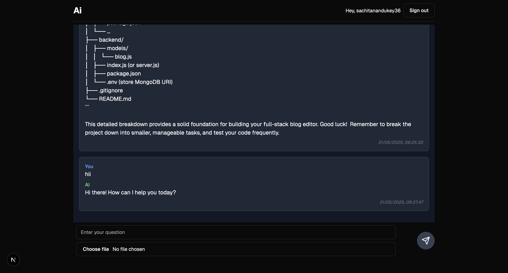

# AI Chatbot with PDF Upload (Next.js + Supabase + Gemini)

This is a full-stack chatbot project built using **Next.js App Router**, **Supabase**, **Google Gemini API**, and **pdf-parse**. Users can upload PDFs and ask questions about their contents. The app parses the PDF, sends the question and content to Gemini, displays the response, and stores all chats in Supabase and a `.txt` file.

---

## 🔧 Features

- User Authentication via Supabase
- Upload PDFs and ask questions
- AI responses using Gemini API
- Chat history persisted in Supabase DB
- Responses logged in `public/chat-log.txt`
- Built entirely in Next.js (no separate backend)

---

## 🧩 Tech Stack

- **Frontend & Server**: Next.js (App Router)
- **Auth & DB**: Supabase
- **AI**: Google Gemini API
- **PDF Parsing**: pdf-parse
- **Styling**: Tailwind CSS

---

## 📁 Project Structure

```
/app
  /protected         # Chat page + server actions
/components
  Chats.tsx          # Chat message UI
  InputForm.tsx      # Upload + input form
/contexts
  AppContext.tsx     # Global chat context
/utils
  supabase/          # Supabase client/server utils
/public
  chat-log.txt       # Text file for logging responses
```

---

## ⚙️ Environment Setup

Create a `.env.local` file with:

```env
GEMINI_API_KEY=your_gemini_api_key
NEXT_PUBLIC_SUPABASE_URL=your_supabase_url
NEXT_PUBLIC_SUPABASE_ANON_KEY=your_supabase_anon_key
SUPABASE_SERVICE_ROLE_KEY=your_service_role_key
```

---

## 🚀 Getting Started

```bash
npm install
npm run dev
```

App will run at [http://localhost:3000](http://localhost:3000)

---

## 🗃️ Supabase Table Schema

### chat_history

| Column     | Type         | Description                 |
|------------|--------------|-----------------------------|
| id         | UUID         | Primary key                 |
| user_id    | UUID         | Foreign key to auth.users   |
| question   | TEXT         | User's question             |
| answer     | TEXT         | AI's answer                 |
| created_at | TIMESTAMPTZ  | Timestamp of the interaction|

---

## 📝 Logs

All interactions are also appended to:

```bash
/public/chat-log.txt
```

Example format:

```
[2024-05-20T18:30:00Z]
User: What is the purpose of this assignment?
AI: This assignment is designed to test your ability to build a full-stack app...
```

---

## 🧪 Tools Used

- ChatGPT (prompt help and architecture)
- GitLab (version control)
- Supabase Auth + DB
- Google Gemini for AI
- pdf-parse for file reading

---

## 📤 Submission Checklist

- ✅ Source Code (frontend + server in Next.js)
- ✅ Supabase SQL schema or table structure
- ✅ chat-log.txt file in public directory
- ✅ Hosted Git repo ( GitHub)

---

## Screenshots

### Chat Interface



